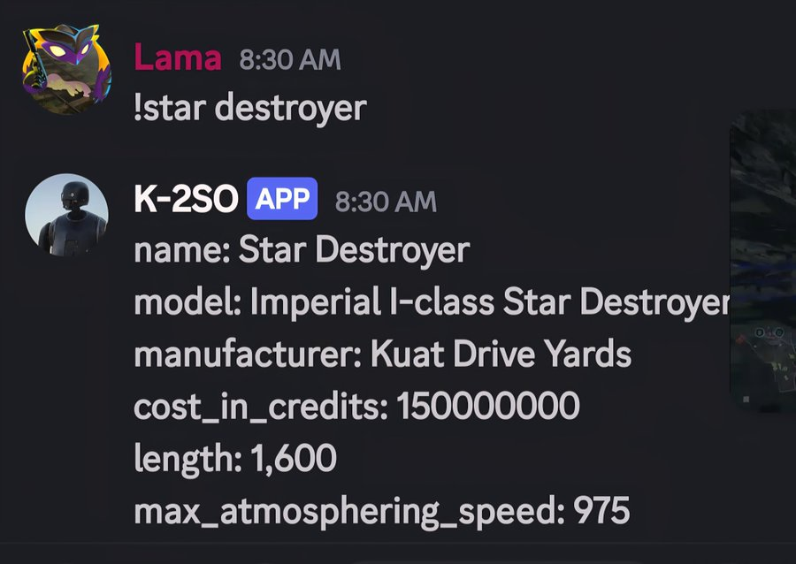
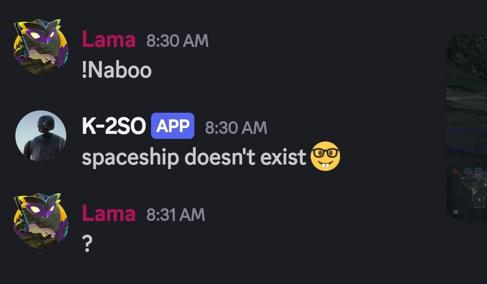

# K-2SO🤖
simple discord bot built on star wars api (SWAPI) 

# setup and prereqs
Python 3.10+ and a Discord bot token.
Enable "MESSAGE CONTENT INTENT" in the Discord Developer Portal for your bot.

1. clone this repo
   
   ```
   git clone https://github.com/lamaplays/K-2SO.git
   cd K-2SO
   ```
3. Install dependencies
   
   ``` pip install -r requirements.txt ```
   
3.create .env file
  (See .env.example for a template.)

4. quick test
   
   ``` python k2so.py ```

## example command 




   
   
